# VibeAnimate

**A code-first animation studio, and the music film made in it.** Scenes
are React components lit and moved by three.js; a browser editor
sequences, scrubs and edits them against the song; Remotion renders the
result to video. No footage, no keyframes in a GUI — the film is source.

> **Status: TBA — coming soon.** The first film, *Body to Body*, is in its
> final cut. The full video will be linked here when it is released.

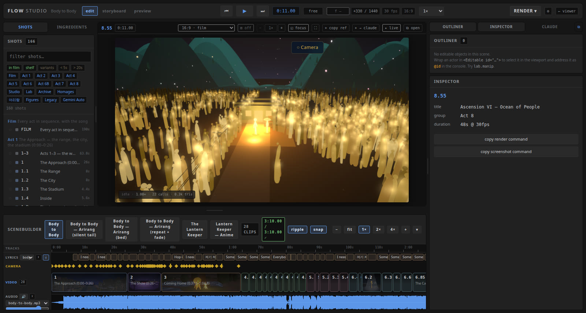

## The studio

Open `/?app=studio`. It is one page: a shot list on the left, the stage in
the middle, an inspector on the right, and the Scenebuilder — the master
timeline — underneath. Everything you see is the running scene code; the
editor never holds a copy of anything.

### The editor

- **Shot list.** Every scene in the manifest (166 here), filterable by
  act, film, variant, length, or text. Click one and the stage loads it
  **at its master offset**, so what you are looking at is the frame the
  film will have.
- **Stage.** The live scene, with an aspect-ratio frame, safe-area guides,
  the lyric overlay, and a stats line (fps, draw calls, triangles). Toggle
  the debug camera and orbit anywhere; the scene's own rig stands down
  while you do.
- **Inspector.** The clip's timing, editable; *copy render command* and
  *copy screenshot command* give the exact CLI for this frame; edits emit
  regex-safe `timeline.ts` lines to paste back into the source.
- **Scenebuilder.** Film switcher chips (the master and its alt-audio cuts,
  the second film and its anime cut); a lyric track, a camera-move track,
  the video clips and the song's waveform. Drag-trim, ripple or overwrite,
  snap, drag to reorder, zoom. Keys: Space, ←/→ (Shift ×10), J/K/L
  shuttle, Home.

### Storyboard

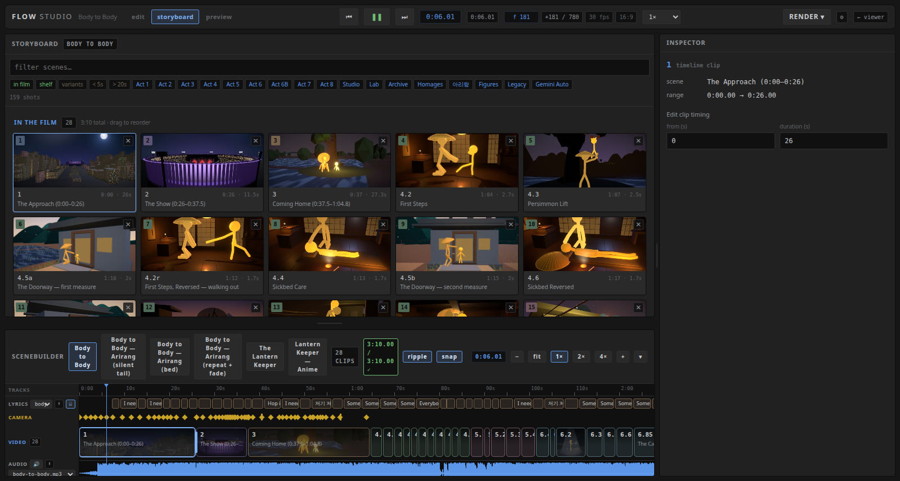

Every shot as a card with a live thumbnail, in film order; the *in the
film* row is the cut, and dragging a card is an edit; every other shot is
a filter away, ready to be dropped in.

### Ingredients

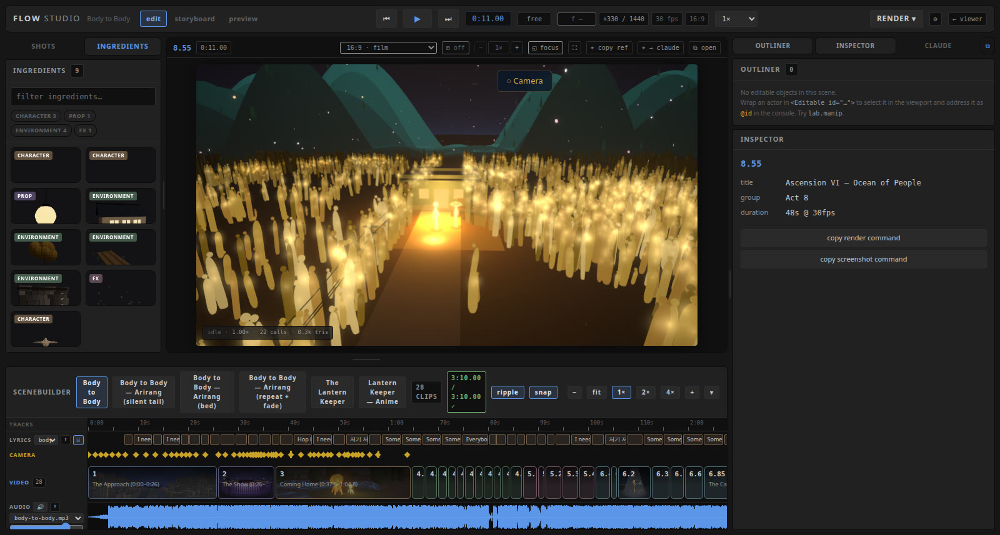

Characters, props, environments and effects, declared once and imported
everywhere — the way a figure looks the same in the kitchen at 1:35 and on
the road at 2:45. Each card is a live preview of the component, not a
saved picture.

### Claude in the sidebar

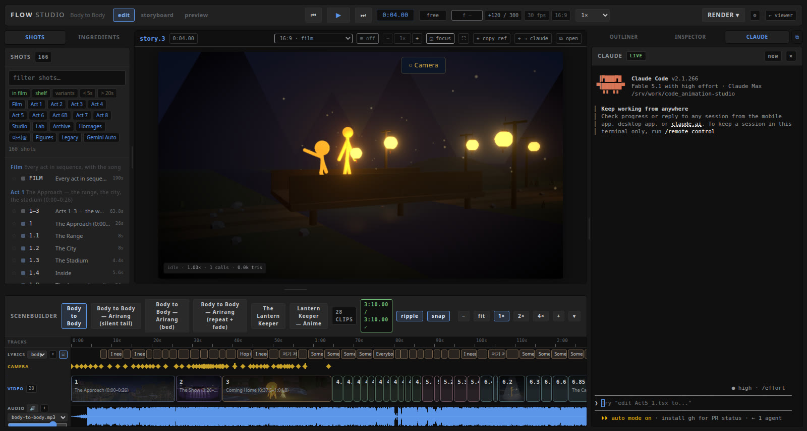

The right panel's third tab is a terminal running Claude Code in the repo.
Frame a shot on the stage and press **⌖ → claude**: the exact pose — time,
film frame, camera position and target, fov, a PNG — lands in its prompt as
a *shot ref*, so "make it look like this" comes with the numbers. The same
console takes direct commands on editable actors: `@keeper move y 0.5`.

### Blender mode

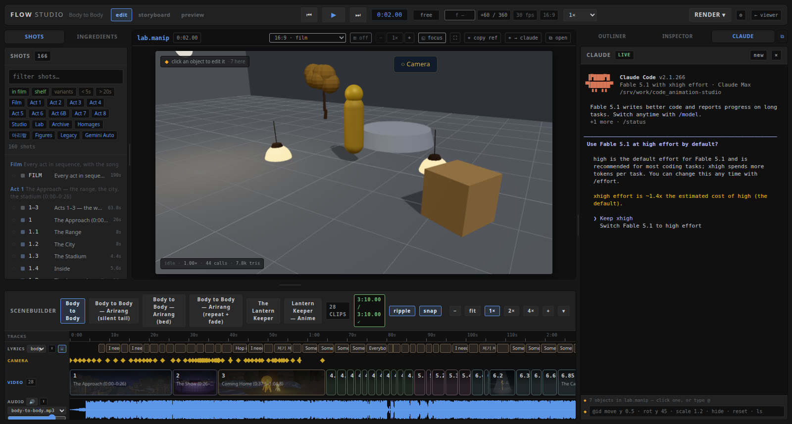

Wrap an actor in `<Editable>` and it becomes selectable on the stage:
transform gizmo, N-panel numeric fields, an Outliner row, and G/R/S,
X/Y/Z, Alt-reset, H hide, Tab cycle — the Blender keys. Edits are
non-destructive and scoped to the studio; *copy JSX* pastes the pose back
into the scene source, which is the only place a pose ever lives.

### Live AI render

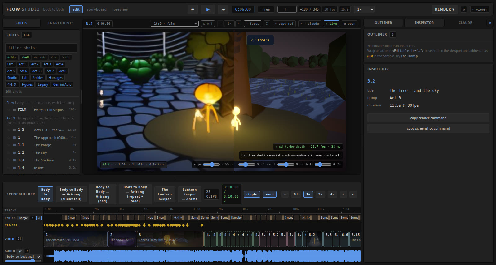

Press **✦ live** and the frame on the stage is pushed through a diffusion
model on the local GPU and drawn back over the picture: the viewport
captures its own colour and a depth map (a second render with a depth
material, normalised to the shot), a small server runs SD-Turbo with a
depth ControlNet at 512×288, and the reply lands on the stage with an A/B
wipe, a prompt box, and strength / depth / hold knobs. Fixed seed and a
blend of the previous frame keep it from flickering. Measured on an RTX
3090: ~50 ms a frame, 20 fps on the bench, 10–15 fps in the editor. It is a
preview of a look, not a render — the raw film stays the source of truth.
`scripts/live-render/setup.sh` builds the venv; the chip starts the server.

### Rendering

Remotion renders every timeline slot as a cached segment, in parallel
browser processes on the GPU (ANGLE-over-Vulkan in headless Chrome); the
master is stitched with stream-copy and the song muxed on top. A 4K master
takes about twenty minutes. The **Render** menu in the top bar runs the
same pipeline from the editor — quality, GL backend, shards and
concurrency are settings. A headless Blender/Cycles backend (`blender/`)
mirrors the same concepts in bpy for the NPR looks the browser cannot do.

## How this differs from Remotion

Remotion is the render backend here, not the product. Every scene in the
manifest auto-registers as a Remotion composition and the final mp4 comes
out of `remotion render`. What Remotion gives you is React → frame-exact
video, `<Sequence>` composition, and Remotion Studio, which previews
compositions and lets you tweak props. What it deliberately does not give
you, and what this studio adds on top of it:

| | Remotion / Remotion Studio | Flow Studio |
|---|---|---|
| **the cut** | in code (`<Sequence from=…>`); Studio's timeline is a viewer | an NLE-style Scenebuilder: drag-trim, ripple, reorder, snap, J/K/L — and it exports the `timeline.ts` lines back to source |
| **3D** | bring your own three.js | persistent **worlds** (one environment, many shots), an Outliner, a transform gizmo, `@object` commands — Blender mode |
| **reuse** | components | an **Ingredients** registry: characters, props, environments, fx declared once, live-previewed, referenced everywhere |
| **the author** | you | **Claude Code in the sidebar**, with shot refs: camera pose + clock + a PNG handed to the model as one token |
| **the clock** | frame / fps | one animation clock shared by live playback, `?t=` scrubbing, CSS keyframes and the render — with a lyric lane on top |
| **the render** | one `remotion render` | per-slot segment cache, parallel Chrome shards on Vulkan, stream-copy stitch, song mux; a review server that seeks |
| **what a scene is** | a composition | one manifest line that is also a URL, a nav entry, a screenshot target, a smoke-test target and a composition |
| **the picture** | what three.js draws | optionally pushed live through a depth-guided diffusion model on the local GPU — SD-Turbo at ~20 fps, a prompt as the look, an A/B wipe on the stage |

Remotion's license is free for individuals and small teams and paid above
that. Everything in this repository is MIT, source only.

## The films

### The first film — *Body to Body*

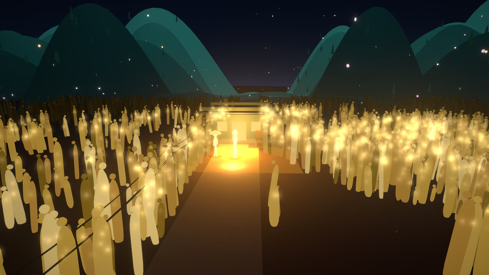

3 minutes 21 seconds, one world, and a camera that does not cut for the
first minute. It opens on a lit farmhouse at the end of a black road, flies
over the range, through a city canyon, over a stadium wall and into the
bowl — then all the way back out again, over the rice fields, to a tree, a
road home and a table. The middle is a life: a childhood in eight beats, a
separation, an audition, a rise — and a grandmother watching a screen full
of seven identical boys, who learns which one is hers because he waves.
The end is the Arirang, sung standing on the road, and the field rising
into the sky as stars.

| | |
|---|---|
| 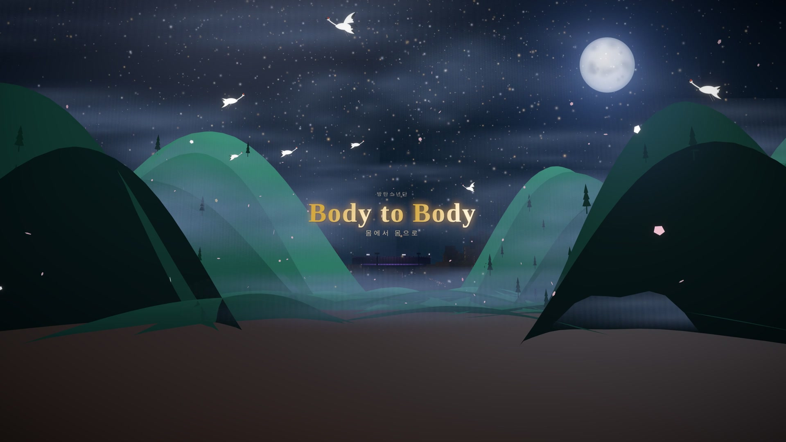 | 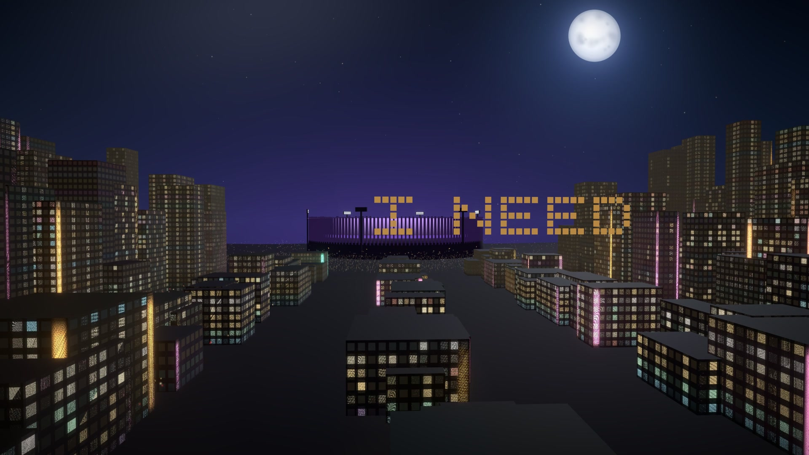 |
| *The range* | *The canyon* |
| 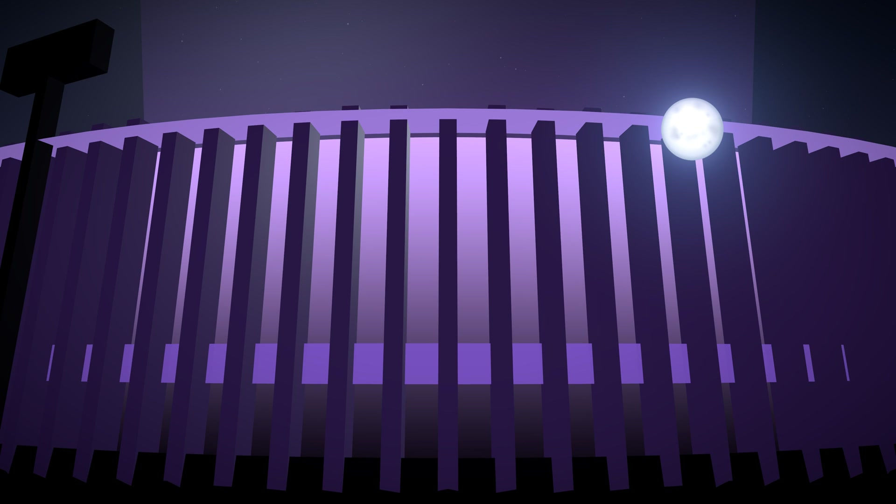 | 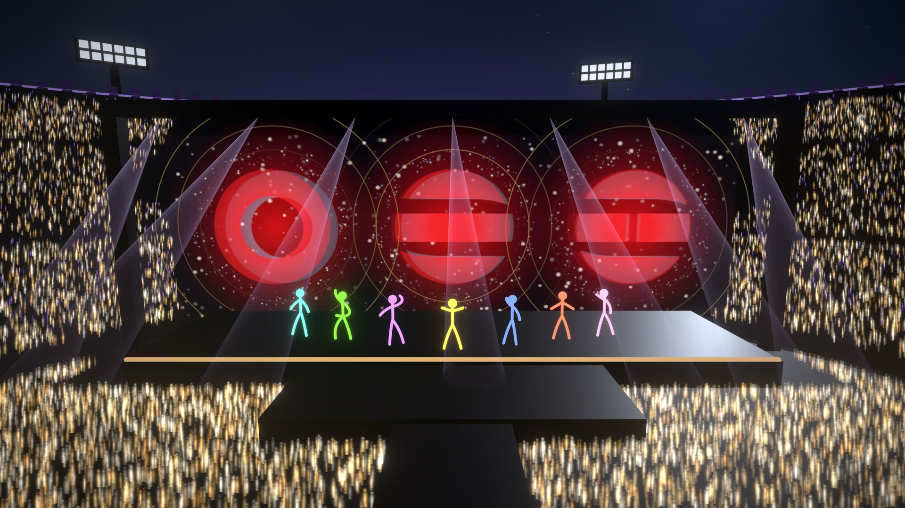 |
| *The stadium* | *The show* |
| 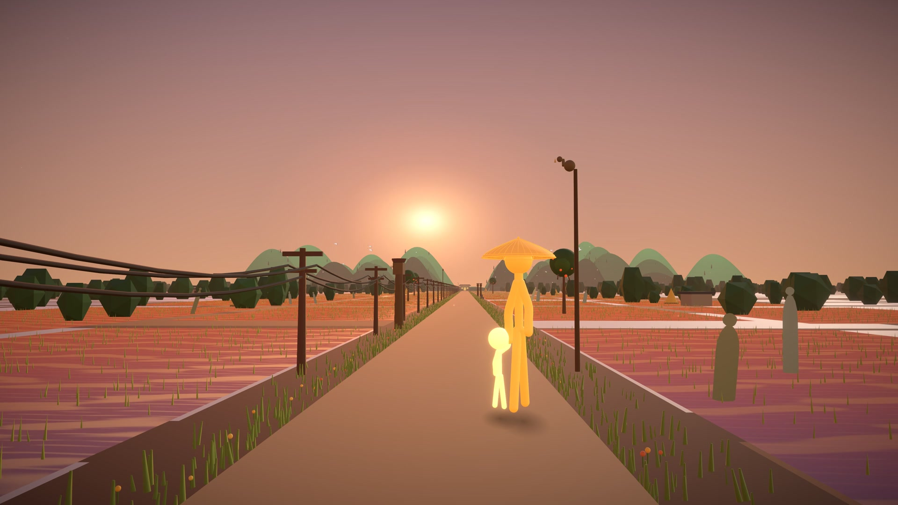 | 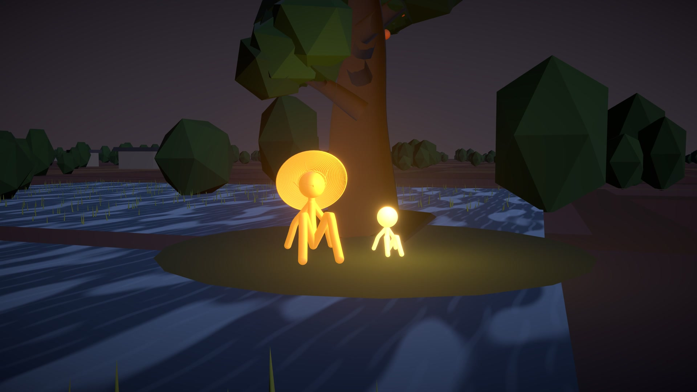 |
| *The road, golden hour* | *The tree* |
| 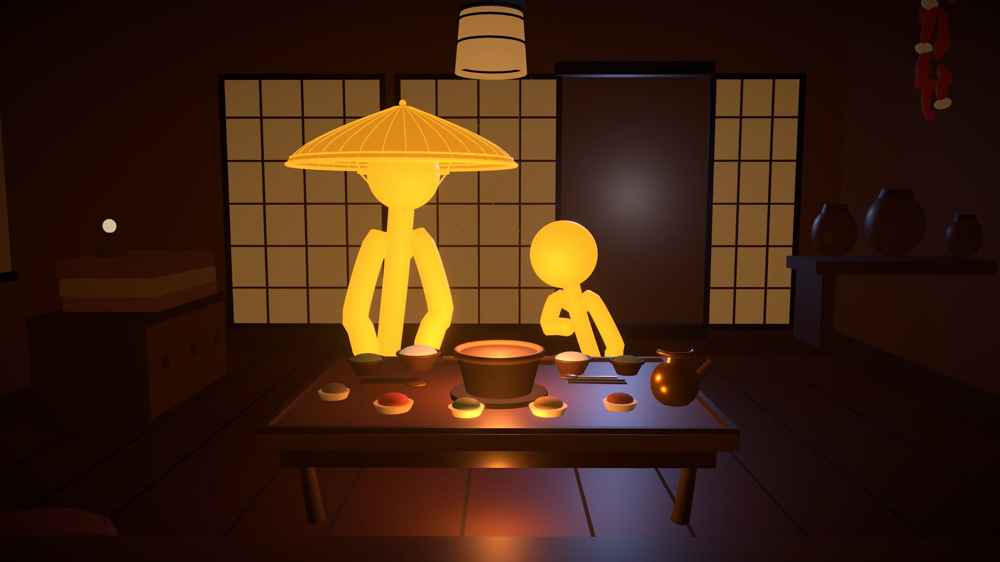 | 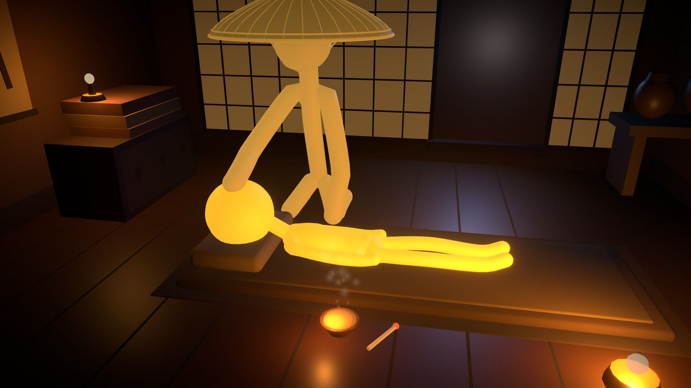 |
| *The table* | *The pat* |
| 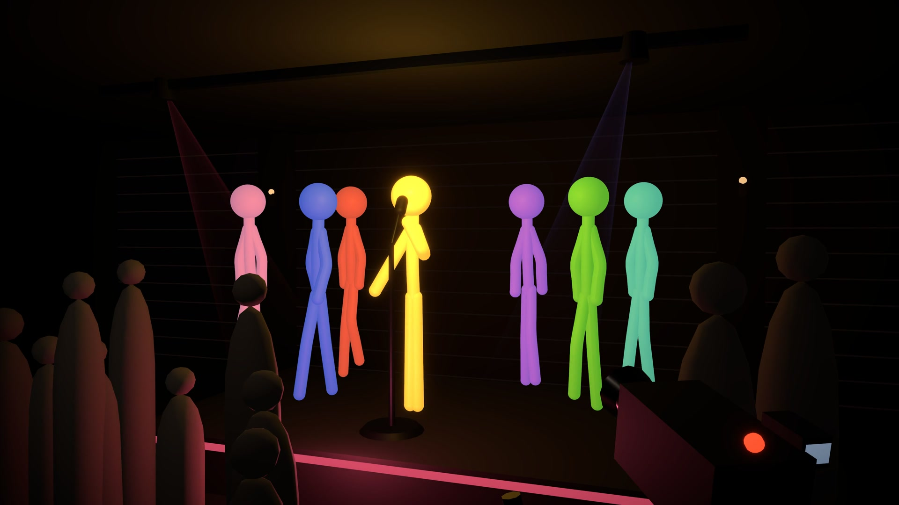 | 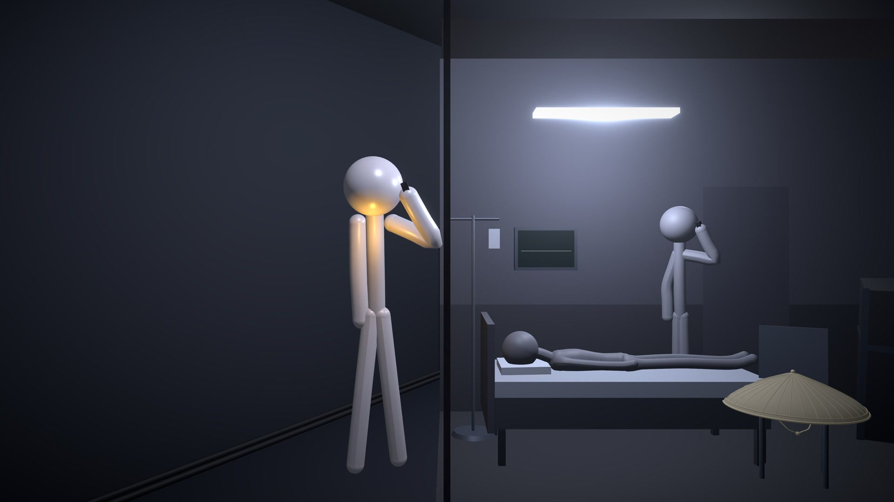 |
| *The interview* | *The silence* |
| 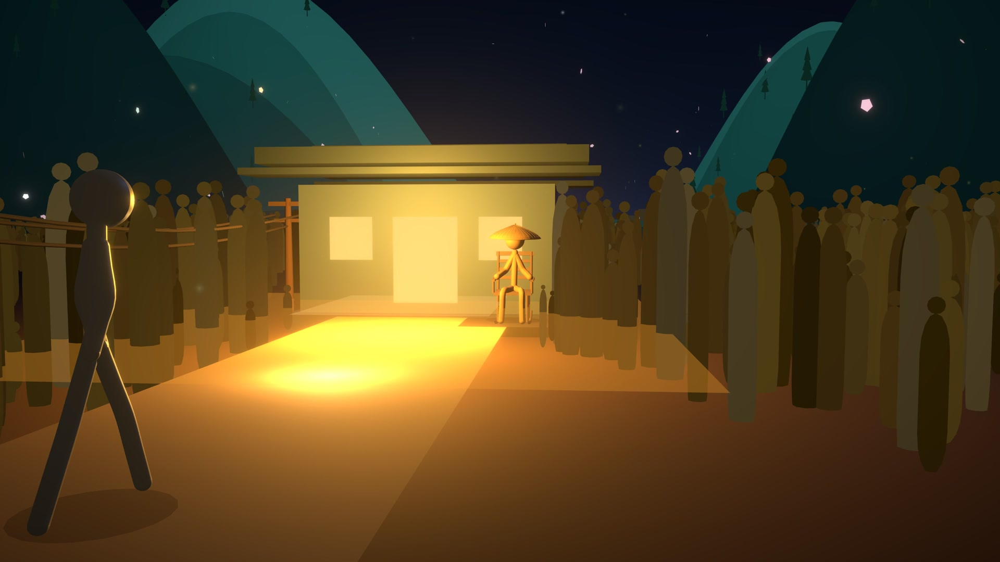 | 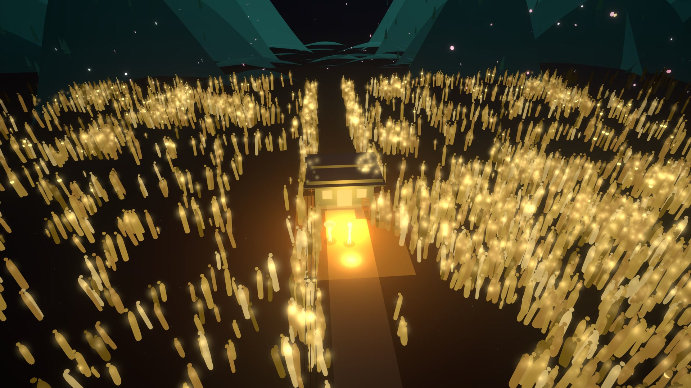 |
| *The walk home* | *The ascension* |

`FILM.md` is the cut sheet — every scene, the lyric it stands on and the
seconds it owns.

### The second — *The Lantern Keeper*, and its anime cut

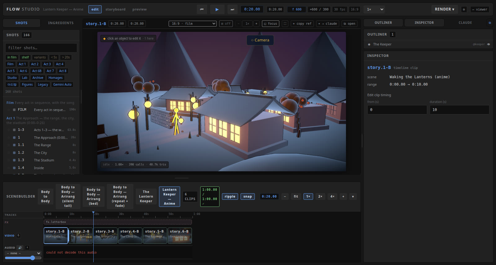

*The Lantern Keeper* is a 60-second original built in the studio's
**worlds** model — one persistent environment, a shot = camera move +
lighting preset + which regions are mounted. Its anime cut swaps every
material for toon shading, rim light and outlines with one component
(`<ToonSwap>`), which is why it is a film switcher chip and not a fork.

## How it is built

- **React 19 + TypeScript + Vite** — every scene is a component,
  registered once in `src/scenes/manifest.ts`; the viewer, the tooling and
  the Remotion compositions all derive from that one list.
- **three.js via React Three Fiber** — the opening acts are one 3D world
  laid out along a single axis (mountains, star field, city, stadium and
  its 46,000-strong crowd, the valley); the only thing that moves is the
  camera. Point clouds are one seeded, additively-blended draw call each.
- **One deterministic clock.** Live playback and video rendering share the
  same time store, so `?t=12.5` in the browser is the exact frame the
  renderer produces — scrub, freeze, step and screenshot any moment.
- **Camera as data.** Flights are Catmull-Rom keyframes on position,
  look-at and fov, anchored to vocal onsets measured off the stems; a
  time-warp maps story seconds onto film seconds so a 31-second journey can
  play in 10 without re-keying anything downstream.

`CLAUDE.md` holds the engineering notes and the traps; `docs/studio/` has
the studio's goal, PRD, spec, roadmap and the story bible.

## Running it

```bash
npm install
npm run dev            # http://localhost:5173
```

- `/?app=studio` — the studio (`&tab=ingredients`, `&view=board`,
  `&film=story-anime` deep-link into it)
- `/?act=film` — the film, start to finish, in the browser
- `/?act=<key>` — one scene (`/?act=` with no key lists them all)

The song is not in this repository. Put your copy at
`public/audio/body-to-body.mp3` and the film plays with it; without it the
picture runs silent. *The Lantern Keeper* needs no audio.

Rendering: `npm run render:fast` (master, cached segments),
`npm run render:act -- <key>` (one scene), `npm run preview:film -- story-anime`
(fast preview, no GPU needed).

## License and credits

Source code is MIT (see `LICENSE`); media is excluded. *Body to Body* is
performed by BTS — this is an independent, non-commercial fan work; the
song remains the property of its owners and is not distributed here.
