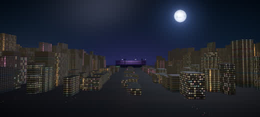

# Flow Studio — Work Order 48

> The current build queue. Companion to `GOAL.md` (what winning looks like),
> `PRD.md` (requirements + research) and `SPEC.md` (technical design) — when an
> item here ships, its design moves into SPEC.md and the item is struck from the
> build order below. Opened 2026-08-11.

Everything dictated on 2026-08-11, grouped by the part of the editor it touches and
checked against the code that is there now. Every claim below was read from source or
measured against the running dev server, then independently re-verified; line numbers
are as of this writing.

**Eight of these turned out to be defects rather than preferences.** One is a live
security hole. Those come first.

> **Status: every pass in the build order at the bottom of this file has
> shipped.** Seven of the eight defects are fixed; `D6` (FrameGovernor on
> Acts 1–3) is open, with the symptom confirmed and the cause not isolated.
> The ledger, and the four things that turned out differently than planned,
> are at the end.

## Decisions on record

| | decision | consequence |
|---|---|---|
| **Aspect** | A film can genuinely BE 9:16 or 1:1, not just previewed that way | S2 splits: a stage picker now, the render pipeline later (S5) |
| **Write-back** | Master stays paste-only; story films keep `/__studio/apply-timeline` | Confirms the existing call — `timeline.ts`'s beat comments are documentation |
| **Camera** | Camera keyframes become a visible, draggable timeline lane | S3 splits: fix the defect now (S3), build the lane later (S4) |
| **Timeline feel** | ~~Premiere muscle memory — overwrite default, Ctrl-drag inserts~~ · **revised: insert is the default, Ctrl-drag splices**, S toggles snap | See the invariant conflict in T1, and the revision note under it |
| **Console** | It becomes an agent prompt line, not just a shell | K2 knowingly retires a documented non-goal — see K2 |

---

## Defects

| id | severity | what is wrong | status |
|---|---|---|---|
| **D0** | **critical** | `/__studio/exec` and `/__studio/apply-timeline` are completely ungated | **fixed** `b14ad11` |
| **D1** | high | You cannot type in the console, and trying destroys your edit | **fixed** `b14ad11` |
| **D2** | high | The ● Camera button puts you where the scene isn't | **fixed** `1a9ff3f` |
| **D3** | medium | The clock lies after opening `?act=film`, and the transport breaks | **fixed** `b8ead5d` |
| **D4** | medium | `fmtTime` frame math is wrong under accumulation | **fixed** `825b507` |
| **D5** | medium | `preview:film` captures the *wrong worktree* and writes garbage | **fixed** `825b507` |
| **D6** | medium | FrameGovernor is dead on Acts 1–3 — the only 66s that need it | open |
| **D7** | medium | A render dies when you reload the tab | **fixed** `dfde076` |

Each fix is described in its commit message, with the measurement that proves
it. What follows is the diagnosis as written before the fixes landed; it is
kept because the *reasoning* is what stops these recurring, and because **D6
is still open**.

### D0 · Both write-capable dev endpoints are ungated — CRITICAL

`vite.config.ts:35` spawns `bash -lc <cmd>` with `cwd` = repo root and the full parent
`env`. There is no auth token, no `Origin` check, no allowlist, and no content-type
check — the middleware `JSON.parse`s the body regardless (`vite.config.ts:27`).

A `content-type: text/plain` POST is a **CORS-simple request**: no preflight, so the
browser sends it and only *blocks reading the response*. The command still runs.
Verified live:

```
curl -X POST http://localhost:5174/__studio/exec \
  -H 'content-type: text/plain' -H 'Origin: https://evil.example.com' \
  -d '{"cmd":"id -un && pwd"}'
→ ubuntu / /srv/work/code_animation-studio / [exit 0]
```

So **any web page opened in any browser on this machine, while the studio dev server
is running, can execute arbitrary shell as the dev user** — `rm -rf`, `git push
--force`, read `~/.ssh`, `curl … | sh`. Blind (the attacker cannot read output) but
fully effective.

`/__studio/apply-timeline` (`vite.config.ts:63-117`) has the identical surface and
calls `writeFileSync` at `:106`. `/__studio/media` (`:127-149`) is GET and read-only —
genuinely fine.

"Dev-only" (`apply: 'serve'`, `:18`) and "localhost-bound" are **not** defences here:
the request originates from inside the machine, from the browser.

**Fix.** Require all three of: an `Origin`/`Host` check against the dev server's own
origin; `content-type: application/json` (which forces a preflight the attacker cannot
satisfy); and a per-session token minted at server start, injected into the page, and
echoed in a header. Cover **both** write-capable endpoints. Small, self-contained, goes
first.

### D1 · You cannot type in the console, and trying deletes clips

The input exists and works — `ConsolePanel.tsx:359-383`, measured live at 1524×17px,
`disabled:false`, `readOnly:false`, hit-testable, and a full round-trip succeeds once
focused (`echo HELLO-FROM-PROBE && pwd` returned correctly).

**It is never focused.** There is no `autofocus` and no mount-time focus effect; the
only `focus()` call in the file is at `ConsolePanel.tsx:241`, inside `acceptCompletion`
— i.e. only after picking an `@object` from the completion menu. After clicking
`⌨ console`, `document.activeElement` is still BODY.

Both keymaps guard correctly on `INPUT`/`TEXTAREA`/`isContentEditable`
(`FlowStudio.tsx:379`, `editable/keys.ts:17-24`) — **the failure is upstream of the
guards.** Focus is on BODY, so the guards never apply and `FlowStudio.tsx:388-475`
treats your typing as the edit keymap:

| you type | what actually happens |
|---|---|
| space | toggles playback (`:393`) |
| `b` | **blades the selected clip** (`:421`) |
| `v` | flips to storyboard (`:461`) |
| `1`/`2`/`3` | switches film (`:416`) |
| `j`/`k`/`l` | shuttles (`:466-474`) |
| Backspace | **deletes the selected clip** (`:435`) |
| `` ` `` | closes the console again (`:389`) |

That is exactly "a console pops up, I can't type, I don't know what it's doing."

Aggravating: the input is `background:transparent, border:none, outline:none` on a 17px
strip (`:379-382`) — no box, no caret, no affordance — and clicking the scrollback
(`userSelect:'text'`, `:300`) does not focus it either. There is also no command
history: `onKeyDown` returns early when the `@` menu is closed (`:363-364`), so
Arrow­Up/Down only move the caret.

**Fix.** Autofocus on open; click anywhere in the panel focuses the prompt; give the
input a real field affordance and a caret; add history on ArrowUp/Down. See K1.

### D2 · ● Camera puts you somewhere the scene isn't

| `?act=1&t=8` | `?act=1&t=8&camera=1` (before) | `?act=1&t=8&camera=1` (after) |
|---|---|---|
|  |  |  |
| Where the shot actually is at 8s. | The mountain range — eight seconds earlier in the flight. | Pose now matches to 3 decimal places. |

Regenerate with `node scripts/shot.mjs --url "http://localhost:5174/?act=1&t=8&ui=0[&camera=1]"`.

The rig bails the instant debug turns on — `if (debug) return`, `actB/World.tsx:140` —
so the camera never leaves the pose R3F declared at mount, which is the scene's *t=0*
pose (`actB/scene.tsx:33`). `debugTarget` (`scene.tsx:48`) is that same stale t=0
look-at. Eight rigs are written this way, so it is every 3D scene. Fix in S3.

**Bonus, same area.** The studio double-buffers, so two scenes are mounted
(`ViewportPanel.tsx:133-158`) and **both** publish `window.__camPose` every frame
(`DebugCamera.tsx:251`) — the hidden one wins whenever it draws last, quietly
corrupting the pose readout and every A/B capture.

### D3 · The clock lies after opening `?act=film`

`manifest.ts:106` registers a `film` entry with no `nav:false`, so it is listed in the
Shots panel and openable. `FullFilm` calls `setAnimTimeOffset(slot.from)` in a
`useLayoutEffect` **with no cleanup** (`FullFilm.tsx:77`) — the only caller in the repo,
and nothing ever resets it.

Verified at `?app=studio&act=film&t=40`: every clock chip read `0:02.15` while
`window.__anim.time` was `40`. Worse, the transport is already broken in that state —
`seekAnimTime` writes master (`useAnimTime.tsx:91-94`) while `getAnimTime()` reads
master−offset (`:71`), so **one ArrowRight moved the clock from 40 to 2.533** while the
chip innocently ticked `0:02.15 → 0:02.16`.

**This is load-bearing for C3**: every frame formula is built on `getAnimTime()`, so
the readouts must go through `getAnimTimeOffset()` (`useAnimTime.tsx:80-82`) or state
an offset==0 precondition. Fixing the leak is the better answer.

### D4 · `fmtTime` frame math is wrong

`theme.ts:119-126` computes minutes, seconds and frames from `t` independently and with
no epsilon. Verified live: thirty `→` presses from zero leaves `t = 0.9999999999999999`,
for which it prints **`0:00.29` instead of `0:01.00`**. Two bugs in one line. Fix: one
canonical integer frame count, `frameOf(t) = Math.floor(t * FPS + 1e-6)`, and derive
m/s/f from it.

Note the literals are fine — every `from` in `timeline.ts` is a multiple of 0.1s, so
every clip boundary lands on an exact frame. The danger is purely accumulated stepping.

### D5 · `preview:film` renders the wrong app

`preview-film.mjs:75-80` spawns `shot.mjs` with **no `--port`**, so it hits shot.mjs's
default **5173** — the *other worktree's* dev server (branch `master`, whose manifest
has no `story.*` keys). Result: all five files in `out/renders/preview/story/` are
byte-identical (`md5 b41aa9ea…`) and show the "Body to Body" title card rather than the
story shots. `out/screenshots/preview_frames/story/` — 461 files, 226 MB — is garbage
for the same reason. `?act=story.1` on :5174 renders correctly.

**Fix.** Pass `--port` through. One line, plus deleting the bad cache.

### D6 · FrameGovernor is dead exactly where it is needed

`FrameGovernor.tsx` provides demand-frameloop, adaptive DPR and the stats chip. Reading
the store after 2.5s of playback: `act=story.1` → `{fps:60, dpr:1.5, calls:423,
triangles:51049}`; **`act=1` and `act=3` → `{fps:0, dpr:1, calls:0, triangles:0}`** —
the module-level default at `store.ts:295`. Chunks load, no console errors,
`window.__camPose` exists so `SceneCanvas` mounted. The actB scenes are the only ones
mounting `<EffectComposer>` (`World.tsx:364`), which is the lead. Cause not isolated.

Consequence: on the 66 seconds of film that need it most, adaptive DPR never engages and
the perf chip reads 0 fps.

### D7 · Renders die when the tab reloads

`vite.config.ts:43-47` SIGTERMs the whole process group on `res` close whenever
`!res.writableEnded`. Verified: killing the client removed the `bash -lc` + `sleep`
group within 2s. So reloading the studio mid-render silently kills the render, and there
is no job registry to reattach to. There is also no concurrency limit — every POST
spawns another render. Fix in R3.

---

## Measured baseline

Worth having on record before anything is "optimised".

| | |
|---|---|
| Master film in the studio, from t=0 | 59 fps decaying to **23.9 fps** by 0:07; **265 ms stall** at the 0:26 cut; ~22 fps through Act 2 |
| `act=3` standalone (28.8s) | 30.8 fps, worst frame 52.5 ms |
| `act=8.55` (48s finale) | 59 fps · 166 calls · 2.27M tris — **not** the bottleneck |
| Story films | 60 fps throughout; cut hitch ~52 ms |
| Same scenes in the plain viewer | identical — **the editor chrome is not the tax, Acts 1–3 are** |
| `render-act 3.2 --frames 0-29` | 15.9s wall (vulkan, 1080p, concurrency 1) |
| `render-act 3 --frames 0-59` | 30.6s wall — ~0.4 s/frame plus 6–9s fixed overhead |
| Cached master re-render, one clip changed | one segment (~30s) + stream-copy concat + mux |

Cached material that already exists: `public/thumbs/` — **155 jpgs, 2.2 MB**, 480×270,
consumed by `thumbs.ts:11` and `Storyboard.tsx:271-275`. The sibling master worktree
holds 359 MB of 1280×720@30 segments covering 25/25 current slots, plus 17 MB of
384×216@12fps proxies covering 22/25 — but **this branch's `render-fast.mjs` has no
`--fps` flag** (the sibling's does), so it cannot produce the proxy tier as-is.

---

## Tracks

| track | items |
|---|---|
| **D** Defects | D0 endpoint gating · D1 console focus · D2 camera · D3 clock offset · D4 fmtTime · D5 preview port · D6 FrameGovernor · D7 render lifetime |
| **S** The stage | S1 focus/fullscreen/zoom · S2 aspect picker · S3 camera handoff · S4 camera track · S5 aspect through the pipeline |
| **T** The timeline | T1 Premiere drag + snapping · T2 collapse · T3 continuous zoom |
| **B** Finding things | B1 stars · B2 filter chips |
| **K** The console | K1 make it usable · K2 make it an agent |
| **R** Render & preview | R1 render button · R2 preview tab · R3 job registry |
| **C** The chrome | C1 track headers · C2 right-rail tabs · C3 timecode readouts · C4 settings panel |
| **F** The foundation | F1 split the shell |
| **X** Unasked-for | X1 clip thumbnails · X3 unified undo |

---

## S — The stage

### S1 · Focus, fullscreen, zoom

**Now.** The stage is pinned between the rails; the only way out is `⧉ open`
(`ViewportPanel.tsx:174`), which launches a *separate tab* at `?act=<key>` — detached
from the timeline and the clock.

**Build.** Focus (collapse both rails) · Fullscreen (stage fills the window, transport
and scrub strip overlaid, Esc back) · Zoom % with pan, for checking a 20-pixel figure on
a dark road.

**Watch.** (a) The stage's `transform` (`:194`) is what cages `position:fixed` scene
layers — fullscreen must keep a transformed wrapper or scenes escape over the chrome.
(b) **`F` is not free** — `DebugCamera.tsx:311` binds it to pitch, and
`FlowStudio.tsx:374-375` explicitly reserves `WASD/QERF` and `,`/`.`/`P`. Pick another
key.

### S2 · Aspect ratio picker, defaulting to 16:9

**Now.** Hardcoded twice, kept in agreement by hand: `aspectRatio: '16 / 9'`
(`ViewportPanel.tsx:192`) and `maxWidth: calc(100vh * 16 / 9)` (`:186`).

**Build.** One `aspect` value driving both. Picker in the stage header: **16:9 default**,
9:16, 1:1, 4:3, 2.39:1, custom. Frame guides: title-safe, action-safe, thirds, centre.

Per the decision, aspect is ultimately a property of a **film**, so it is declared on
`Film` (`films.ts:10-26`, which has no such field today — this is new work, not a
promotion) with the stage picker as a session override.

**Also.** `shot.mjs`'s nominal default *is* 16:9 (`--size 1280x720`, `:105`), but
`--size` becomes `--window-size` (`lib/chrome.mjs:111`), so the real capture is
**1280×577 = 2.22:1** — browser chrome eats ~143px. The fix is compensating for chrome
(`--size 1920x1223`), not changing the default.

### S3 · Camera handoff (fixes D2)

Hand off instead of bailing. A shared `useCameraHandoff()` keeps the rig driving
*through* the frame debug turns on, so OrbitControls inherits the live pose;
`DebugCamera` seeds its pivot from the camera's actual forward vector rather than the
static `debugTarget`. Add **resync to shot** and a **follow** toggle so you can scrub
with the debug camera on. Gate `__camPose` publication and the viewport overlays on
`data-on-top="1"`.

**Touches.** `DebugCamera.tsx`, `actB/World.tsx`, 7 other rigs, `ViewportPanel.tsx`

### S4 · Camera track — keyframes as a timeline lane

**The format already converged.** `{ t, pos, tgt, fov }` is declared *identically and
separately* in `actB/flight.ts:365` (plus `cut?: true`), `act8_51/CameraRig.tsx:24`,
`act8b/CameraRig8b.tsx:29`, `act8_52` and `act8_54`. So this is an extraction, not an
invention: one shared `CameraKey` type + Catmull-Rom sampler, plus a registry mapping
scene key → keyframe source. `act7r/journey.ts:319` (`sampleCam`, distance-
parameterised) is the one genuine outlier — adapt it or mark Act 7's lane read-only.

**Build.** A lane of draggable diamonds under the clips: drag to retime, click to jump
the camera there, Alt-drag to duplicate. Pose comes from the debug camera — frame it,
hit **set key**. Write-back via a new endpoint on the `apply-timeline` pattern.

**The trap.** `flight.ts` keys are **STORY time**; the timeline is **FILM time**, and
they are not the same number — identity below `T_EXIT = 27.4` (`flight.ts:50`), then
story runs ahead by up to `WARP_LAG = 21.5s` (`:120`). `storyTime()`/`filmTime()`
(`:204`, `:215`) are the map. A lane drawn over a film-time ruler must convert both
ways. First thing to get a test.

### S5 · Aspect as a real film property, through the pipeline

**Reach.** `manifest.ts` · `remotion/Root.tsx` (auto-registration, per-composition
width/height) · `timeline.ts` + `FullVideo` · `render-fast.mjs` (**segment cache keys
must include the aspect** or a re-shape silently reuses 16:9 segments) · `shot.mjs`.

**Watch.** 3D acts only need the camera's aspect, which three.js handles. The DOM/SVG
acts are authored against a 1920×1080 viewBox with `preserveAspectRatio="none"` —
reshaping them does not reframe, it **stretches**. That crop-vs-relayout decision is
most of the work, and is why this is its own pass.

---

## T — The timeline

### T1 · Premiere drag semantics, with a drop indicator and snapping

**Now.** The drag shifts the real clip by raw pixels and resolves the destination only
on *release* (`TimelinePanel.tsx:94-118`). Nothing says where it lands, there is no
snapping, and Esc cannot cancel.

**Build.** Drag = insert, Ctrl-drag = splice · **S** toggles snapping, Alt defeats it
for one drag · drop indicator with neighbours sliding open · magnetic snap to clip
boundaries, playhead and lyric cues, with the snap line drawn and the offset on the drag
chip · ghost as its own element so the track can reflow · Esc cancels.

**Conflict to resolve, not ignore.** `remotion/timeline.ts:192-213` **throws at module
load** on a gap, an overlap, or a total ≠ 3:10. Overwrite produces all three. So:

- the timeline stays **gapless by construction** — the drag re-orders rather
  than leaving a hole, which is what `repackOrder` already does;
- a gap that does appear renders as an explicit red **GAP** block and blocks export,
  visibly, rather than being silently repacked;
- the 3:10 total means the master film is **length-locked** — you redistribute cut
  points, you do not extend. Hence a **length budget chip**: `3:10.00 / 3:10.00 ✓` or
  `+2.5s over`. Today nothing warns you until the module throws.

**Also.** Trim is out-point only, 0.5s snap (`:44`, `:313`). Give it both edges,
frame-accurate, Alt to defeat.

**Shape.** `resolveDrop(items, index, dxSec, opts)` as a pure function beside `edit.ts`,
unit-tested like `splitClip`/`trimDuration` already are.

### T2 · Collapse the Scenebuilder

Fixed 262px today (`FlowStudio.tsx:560`). Drag the divider to resize; chevron or
double-click collapses to a ~24px rail that still shows the playhead; one key toggles;
height persisted.

### T3 · Continuous zoom, keeping the presets

Keep fit / 1× / 2× / 4× (`:186-192`). Add Ctrl+wheel and `+`/`−`, anchored on the
**playhead** rather than the scroll origin, plus zoom-to-selection.

---

## B — Finding things

### B1 · Stars

**Now.** Nothing. `grep -rn "star|favou|favor"` over `src/studio` and `docs/studio`
returns only the word "start". `SceneEntry` (`manifest.ts:23-40`) carries `key`,
`label?`, `title`, `group`, `transition?`, `nav?`, `durationSec?`, `load` — no user flags.

**Where they live.** *Not* in `manifest.ts`. Not for the reason first proposed — the
write-back regex at `vite.config.ts:93` is lazy and tolerates an inserted field (proven:
155/155 titles still extract with a `star:` field injected, and 33 entries already carry
`label:` between `key` and `title`) — but because another session edits this repo
concurrently and a starred scene is a *personal* view preference, not a property of the
film. `localStorage`, in the planned `useStudioPrefs` store.

**Watch.** `T.gold` is byte-identical to `T.accent` (`theme.ts:23` and `:30` are both
`#5b96e8`; `gold` is a legacy alias, see `:21-22`), and the active row already uses it
(`ShotList.tsx:67`, `:78`). A "gold star" would be invisible against an active row —
**a new token is required.** And `F` is taken (see S1), so pick another key.

### B2 · Filter chips

**Now.** Two independent, duplicated, substring-only boxes: `ShotList.tsx:17` (predicate
`:23-27`) and `Storyboard.tsx:47` (predicate `:52-53`). Both match **`key` and `title`
only** — not `label`, not `group`. Switching edit↔board loses what you typed. And the
header count chip reads `SCENES.length` = 155 regardless of the filter
(`ShotList.tsx:35`).

**Dimensions that already exist**, derivable with no new metadata: act/group (19 groups,
`manifest.ts:49-83`), in-the-current-film vs shelf (25 of 155 are used by the master;
shelf is 123 after removing 6 `nav:false` and the Film group), variant (`-B`/`-C` suffix),
3D vs DOM (presence of `three` in the scene meta), duration bands, has-a-thumbnail.

**Build.** A chip row beside the box, multi-select, OR within a dimension and AND across
dimensions, plus a `★` chip. Shared state so it survives edit↔board. Fix the count chip
to show `matched / 155`.

**Watch.** The chip component must accept a colour — `AssetBrowser.tsx:12-18` uses
per-category `CAT_COLORS` (applied `:114`, `:116`), not `btnActiveStyle`, and a naive
shared component silently drops ingredient category coding.

---

## K — The console

### K1 · Make it usable (fixes D1)

Autofocus on open · click anywhere in the panel focuses the prompt · a real field
affordance with a caret · command history on ArrowUp/Down · and, defensively, the
transport keymap should ignore keys while the console is open even if focus escapes.

### K2 · Make it an agent

**What it is today.** Not an AI, not close — there is no LLM code in this repo at all
(`grep anthropic|openai|/v1/messages` over `src/`, `scripts/`, `package.json`: zero
hits). `ConsolePanel.submit()` (`:215-228`) is a two-branch dispatcher:

1. `parseEntityCommand` (`editable/commands.ts:50-107`) — a pure, unit-tested
   mini-language: `ls`/`objects`, and `@<id> <verb> …` where verb ∈ `move|mv|nudge`,
   `pos|position|loc|location|place`, `rot|rotate|rotation`, `scale|size`,
   `hide|show|select|info|code`, `reset [pos|rot|scale]`.
2. anything else → `bash -lc` in the repo root via `/__studio/exec`.

**What is available.** `claude` is on PATH — `/home/ubuntu/.npm-global/bin/claude`,
**v2.1.220** — with `-p/--print`, `--output-format stream-json`,
`--include-partial-messages`, `--permission-mode`, `--allowedTools`, `--model`,
`--append-system-prompt`, `--session-id`, `--resume`/`--continue`. The exec endpoint
already streams stdout incrementally (verified: a 3-second `tick` loop arrived
incrementally over 3.0s). So the wiring is short.

**Two things this must do consciously.**

1. **It retires a documented non-goal.** `SPEC.md §12.5 #2` says the studio must never
   write files freehand from the browser; `PRD.md:127,129-130` lists "No server/backend"
   and "No in-browser editing that writes files directly to disk" as explicit non-goals;
   `GOAL.md:13-15` and `PRD.md:65,72` position Claude Code as **external** to the app.
   An agent prompt line with edit permission is exactly the thing those forbid. The
   decision is made — but it must be written into SPEC.md, not smuggled in.
2. **Units.** `commands.ts:86` converts degrees→radians, so `@keeper rot y 1.57` is
   **1.57 degrees** (≈0.027 rad — visually nothing), not 90°. An agent that emits
   radians will silently produce a 1.6° nudge. Put the unit in the system prompt.

**Watch.** `--model claude-opus-5` is not a documented value — `claude --help` documents
`fable`/`opus`/`sonnet` or a full model name. Use `--model opus`. And `--permission-mode
acceptEdits` is one of six valid choices; the help does not call it the default.

---

## R — Render & preview

### R1 · A real render button

**Now.** Three buried surfaces: a `render clip` chip in the console header
(`ConsolePanel.tsx:254` → `npm run render:act -- <key>`), a `preview film` chip (`:255`),
and a clipboard-only "copy render command" in the Inspector (`:184`). `render:fast` — the
cached, parallel master path — is not reachable from the UI at all. You learn a render
finished only by watching raw stdout scroll past. No toast, no badge, no output link, no
way to play the result.

It lives in the console only because **the console is the studio's only streaming-output
surface**: per-scene tabs (`:175-182`), coalesced stdout (`:163-172`), and a `kill`
button that group-SIGTERMs (`:287-292`). The right move is to lift the *launcher* into
the top bar and keep the console as the log sink — not to invent a second output surface.

**Build.** A `RENDER ▾` button in the top bar: this clip · this range · whole film ·
still at playhead. Progress as a pill in the button. Result appears as a playable
`<video>` — **no new endpoint needed**: vite already serves `out/` with byte ranges
(verified `200 video/mp4` and `206` on a Range request).

**The trap that would have shipped a broken button.** "Render this clip" cannot naively
map to `render:act <key> --frames a-b`. A standalone per-scene composition's length is
the manifest `durationSec` (`Root.tsx:37`), and **6 of the 25 master slots are longer
than their scene**: `4.3`, `4.4`, `4.6`, `4.7`, `4.9` are 1.7s slots over 1s
compositions, and `4.10` is 2.5s over 1.8s. Verified — `render-act.mjs 4.3 --frames
0-50` fails with *"durationInFrames was evaluated to be 30, but frame range 0-50 is not
inbetween 0-29"*. So per-clip renders must either clamp and surface the overrun, or route
through `render-fast --only <key>`, which renders the slot's frames out of `FullVideo`
and honours slot duration by construction. **Route through render-fast.**

Second latent gap: `Root.tsx:36` registers per-scene compositions with **no props**,
while `FullVideo.tsx:24` passes `item.props` — so a per-clip `render:act` silently drops
prop overrides. Moot today (no timeline item uses `props` or `offsetSec`) but it will not
stay moot once blading is used.

**Also.** `render-fast` is master-only — it hardcodes `src/remotion/timeline.ts:99` and
`public/audio/body-to-body.mp3:44`. Rendering a whole story film today means
`render:act StoryFilm720` (no cache, no parallelism) or the screenshot-based
`preview:film`. Generalising it is prerequisite work for the button's "whole film" item
on any film but the master.

**Guardrails the UI must not get wrong**, quoted from CLAUDE.md: GL backend is "the
single biggest speed lever" (7s vulkan / 37s angle-egl / 196s swangle for the same 30
frames); concurrency is per-tab and each tab pays for every canvas the scene mounts (263s
on a good run, **>2 hours** on a bad one, for the same 14s segment); and `render:fast` at
4 shards × 3 concurrency can produce a segment that is *correct but missing its
additively-blended point clouds* — Act 3's whole sky vanished for four seconds and cached
clean. These belong behind an advanced fold with the warnings carried over verbatim, not
on the main menu.

### R2 · Preview tab

A third workspace tab that plays cached segments with live fallback, so the master film
scrubs at speed instead of 22 fps.

**The pattern already exists.** `SongTrack.tsx` is written as "media chases the clock,
never leads" — deadband 0.02s (`:36`), hard-seek limit 0.35s (`:38`), ±4% `playbackRate`
trim (`:40`), seek only on genuine discontinuity (`:129-141`), and `if (el.paused) {
el.currentTime = want }` (`:121-125`) for exact silent scrubbing. It is parameterised by
a `time(): number | null` accessor precisely so a second host can supply a different
mapping. Generalising it from `<audio>` to any `HTMLMediaElement` is a rename, not a
redesign — and it keeps the project rule that there is only ever one clock.

**Staleness is free**: `render-fast` encodes placement in the filename
(`segments/<comp>/<key>@<from>+<duration>.mp4`, `:128-137`), so a retimed slot misses the
cache by construction. Un-rendered ranges show as hatched and fall back to live.

**Prerequisite.** The 384×216@12fps proxy tier the sibling worktree has cannot be
produced here — this branch's `render-fast.mjs` has no `--fps` flag. Port it.

### R3 · Job registry (fixes D7)

Renders must survive a tab reload. Move jobs into a server-side registry with ids, keep
the SIGTERM-on-close behaviour only for explicitly interactive commands, add a
concurrency limit, and let the studio reattach to a running job's stream on load.

---

## C — The chrome

### C1 · Audio and lyrics into track headers

**Now.** A full-width strip above the whole lane stack (`AudioBar.tsx`) carrying source,
level, mute, sheet, cue count and the on-screen toggle.

**Build.** A track-header gutter down the left of the lane stack, each lane owning its
controls — **AUDIO** beside the waveform, **LYRICS** beside the lyric lane. The header
column stays put while lanes scroll sideways; that fixed column is most of what makes a
timeline read as an NLE, and it is where S4's camera-lane controls will go.

### C2 · Console into the right rail, as a tab

**Now.** A drawer between the viewport row and the timeline (`FlowStudio.tsx:555`) that
shoves both.

**Build.** Right rail becomes tabbed — **Outliner · Inspector · Console**. Backtick
focuses the console tab rather than opening a drawer. Keep a stacked Outliner+Inspector
mode: posing an object reads both at once.

### C3 · Frame, fps and format readouts

**Now.** No frame number anywhere in the studio. Two chips, both `ClockChip`
(`clock.tsx:11-19`) formatted by `fmtTime`: scene-local time and master time (or the word
`free` when detached) — `FlowStudio.tsx:651-654`, repeated at `ViewportPanel.tsx:171-172`
and `TimelinePanel.tsx:183-185`. That last field is **frames, not centiseconds**
(`edit.test.ts:98`: `fmtTime(61.5) === '1:01.15'`) and nothing says so. There is a large
empty gutter in the top bar, so there is room without a redesign.

**fps.** `FPS = 30`, declared once at `manifest.ts:19`, and uniform in render by
construction (`Root.tsx` sets every composition; `RemotionTimeDriver.tsx:20-22` derives
`t = frame / fps`). But **three independent literal copies exist** — `TimeScrubber.tsx:29`,
`render-fast.mjs:43`, `blender/render.mjs:37` — so changing the constant desyncs all
three silently. Worth a shared import while we are here.

**The five coordinates**, which is why this has felt vague:

| # | coordinate | expression |
|---|---|---|
| 1 | scene-local seconds | `getAnimTime()` — what both current chips show |
| 2 | clip-local seconds | `animTime − view.offsetSec` — shown nowhere |
| 3 | master/film seconds | `view.masterFrom + animTime`; per-film, and there are **three** films (190s, 60s, 60s) |
| 4 | song seconds | numerically identical to 3 |
| 5 | Acts 1–3 STORY seconds | `storyTime(film)`, runs ahead by up to 21.5s; live at `window.__flight.t` |

**`offsetSec` is a real in-point** (`timeline.ts:17-19`, rendered as a nested negative
Sequence at `FullVideo.tsx:39-41`), produced by the blade (`edit.ts:54`). No committed
item declares one today, so it only appears after a `B` in session. That gives the
clip-relative frame a real definition.

**Formulas.**

```
frameOf(t)   = Math.floor(t * FPS + 1e-6)          // epsilon is in FRAMES
clipFrame    = frameOf(animTime - view.offsetSec)  // 0 at the clip's first frame
sceneFrame   = Math.round(view.offsetSec * FPS) + clipFrame
masterFrame  = Math.round((view.masterFrom + view.offsetSec) * FPS) + clipFrame
clipFrames   = Math.round(view.durationSec * FPS)  // last frame is clipFrames - 1
```

All of these must read the clock through `getAnimTimeOffset()` — see **D3**.

**Build.** Chips in the top bar: `f 2025` (master, or `—` when detached) · `+184 / 660`
(clip-relative and clip length) · `30 fps` · `16:9`. Click-to-type on the frame chip to
seek. Note `Inspector.tsx:182` already renders `{durationSec}s @ {FPS}fps` — align rather
than duplicate.

### C4 · Settings panel

**Now.** Nothing. Settings are spread across ~40 URL params, hardcoded constants, three
`sessionStorage` keys (`studioFilm`/`studioTab`/`studioView`) and four env vars.

**Build.** A panel — sections Playback · Viewport · Timeline · Render · Keyboard ·
Advanced — riding `useStudioPrefs`. Absorb rather than duplicate: `TimeScrubber`'s
hardcoded FPS + speed list, `AudioBar`'s *defaults* (not a second copy of the live
controls), `TimelinePanel`'s default zoom / snap / ripple, `ObjectToolbar`'s snap
increments and stats-chip visibility plus a global "clear all object edits" that the
per-scene button cannot do, and the Inspector's keymap cheat-sheet (`:149-169`) — today
the only in-app keymap documentation, and only visible when nothing is selected.

**Two hard rules.**

1. **Never persist by rewriting `location.search`.** `SPEC.md:20` hard constraint #5:
   the `shot.mjs` contract is `?act=KEY` + appended `ui=0` + `?t=` freezing, and new URL
   params must not collide. A settings panel that writes the URL breaks deterministic
   screenshots and every cached URL in the docs. Persist to storage; offer "copy link
   with these settings" as an explicit action.
2. **Advanced fold, warnings verbatim.** GL backend, shards/concurrency, `$BLANK_BYTES`
   (the only guard against caching a white segment; `0` disables it), preload/prefetch
   lead (both files say the two-scene ceiling "is not negotiable"), ripple-off and trim
   snap (they make an unexportable film), DPR floor, and the audio deadband (naive
   re-seeking "turns any rendering hitch into audible stutter"). And no toggle may enable
   master write-back, which `vite.config.ts:83` refuses by design.

---

## F — The foundation

### F1 · Split the shell before building on it

**Now.** `FlowStudio.tsx` is 672 lines holding film state, the undo/redo stacks, the rAF
cut loop, the entire keymap, the soundtrack and the layout.

| hook | owns |
|---|---|
| `useTimelineEdit` | items plus undo/redo |
| `usePlaybackCursor` | the cut loop and its prefetch — moves intact, with its comments |
| `useStudioKeys` | one keymap, one place to see conflicts |
| `useSoundtrack` | score and lyric sheet following the film |
| `useStudioPrefs` | one persisted store: aspect override, panel sizes, collapse, active tab, zoom, stars, filters |
| `StudioLayout` | rails and splits, so focus / fullscreen / collapse are one state machine |

Geometry and edit math stay pure and tested in `edit.ts`; drag/snap joins it there.

---

## X — Not asked for, worth doing anyway

### X1 · Thumbnails on the timeline clips

Smaller than it looked: **the thumbnails already exist** — 155 jpgs in `public/thumbs/`,
generated by `scripts/thumbs.mjs`, and the Storyboard already renders them
(`Storyboard.tsx:271-275`, with a colour-card fallback on `onError`). The timeline clips
are the only surface still drawing plain rectangles. This is wiring, not generation.

### X3 · Unified undo

Undo covers timeline edits only (`FlowStudio.tsx:208-239`). Object poses (Blender mode,
`editable/store.ts`) and camera changes are outside it. One history, all three.

---

## Build order — DONE

Every pass shipped. One commit each, with the measurement that proves it in
the commit message; what follows is the ledger.

| pass | items | commit | what it turned out to be |
|---|---|---|---|
| **0** | `D0` | `b14ad11` | Both write-capable endpoints gated. Four attack variants refused, each by a different layer. |
| **1** | `D1/K1 · D2/S3 · D3 · D4 · D5` | `b14ad11` `825b507` `b8ead5d` `1a9ff3f` | The console was never focused, so typing drove the EDITOR. The camera abandoned the shot instead of handing it over — 28 rigs, not the 8 a truncated grep suggested. |
| **2** | `C3 · F1` | `fffb7ca` | 672-line shell → 283. No refs cross a component boundary any more; lint 4 errors → 0. Frame readouts on the bar. |
| **3** | `R1 · R3 · C4` | `dfde076` | Renders became server-owned JOBS and survive a tab reload. The browser sends intent; the server builds the argv. |
| **4** | `S1 · S2` | `9af8ceb` | Three layout modes as one state machine. Zoom is a magnifier, deliberately. |
| **5** | `T1 · T2 · T3 · X1` | `2377bad` | The drag became a PLAN the indicator draws and the release commits. Premiere's overwrite turned out to be arithmetically impossible here — see below. |
| **5b** | `T1` revised | `HEAD` | Insert became the DEFAULT; the exact-placement mode moved to Ctrl and is called `splice`. The plan grew `landsAt`, because insert lands on a boundary and the indicator had been drawing the pointer. |
| **6/7** | `B1 · B2 · C1 · C2` | `0a97436` | One filter for both panels, chips off existing metadata, a track-header gutter, a tabbed right rail. |
| **8** | `K2` | `7c9c2df` | `? …` runs Claude Code headless. Retires a documented non-goal; SPEC.md amended in the same commit. |
| **9** | `R2` | `7b91054` | The film as a video file, chasing the same clock. Staleness is free — the segment filenames already encode it. |
| **10** | `S5 · S4` | `e135c54` `aa9cbfb` | Aspect through the render; camera keys as a lane. |

### The four things that turned out differently than planned

**Premiere's overwrite cannot exist here, and the tests are what proved it
(T1).** The first implementation did the literal thing — lift the clip out,
ripple the hole shut, destroy what it now covered — and a 30s film came back
25s, because that removes the clip's length twice. In a gapless,
length-locked timeline the other clips already total exactly the film minus
this one, so the only operation that both lands the clip where the ghost
showed it and keeps the film exportable is: lay the others out in order,
interrupted at the drop point. What survives from the Premiere decision is
the FEEL, not the arithmetic.

**A cache key you can forget to pass is not a key (S5).** `--aspect` began
as a flag, and I proved it unsafe by forgetting it during the very test meant
to confirm it — one run wrote portrait segments into the landscape cache
directory, which a stream-copy stitch would have concatenated without
complaint. It is derived from films.ts now, the same file the renderer takes
its dimensions from.

**The camera lane had a second offset hiding behind the first (S4).** The
story/film warp was the documented trap and it was handled; the lane was
still empty across Act 3, because Acts 1–3 are WINDOWS into one shot and
`makeFlightScene(37.5)` means local time 0 is film-time 37.5. Missing that
does not fail — it drops every key silently.

**The preview tab needed a check nobody asked for (R2).** Film time maps
straight onto file time, which is right for a whole-film render and silently
wrong for a stale or partial one: the video clamps to its last frame and sits
there looking like a still while every readout keeps moving. The panel
measures the element's own duration and says so.

### After the passes: what the first real session found

Handing the finished studio to someone who had not built it surfaced four
things, three of which were the same kind of mistake — a control that was
correct and unreadable.

**The stage was never letterboxing (the bug that mattered).** `width: 100%`
+ `aspect-ratio` + `max-height: 100%` does not preserve a ratio: CSS treats
`aspect-ratio` as *preferred*, so when `max-height` clamps the height the
width simply stays at 100%. Measured on a 2560×1080 window, a 16:9 film was
drawn on a **3.02:1** stage. It survived a whole build because the picture is
not distorted — the FRAME is — so it reads as a framing choice rather than a
fault, and you are quietly judging a crop the render will never produce. The
cage was also measured in `100vh`, which is the window including the top bar
and the Scenebuilder. `stageBoxCss` derives the width from both container
axes (`min(100cqw, 100cqh × R)`) and constrains nothing else; measured after:
16:9 → 1.7778, 9:16 → 0.5625, exactly. `fit` is the new opt-out, and it is
deliberately NOT a sixth `Aspect` — it is not a shape, and every consumer
that reasons about the delivered frame must keep using the film's own.

**A `?` is not an interface.** The agent worked from the day it shipped, and
was reported as "not connected". One sigil, mentioned on line 4 of a welcome
banner, against a panel that looks exactly like a terminal, is not a
discoverable affordance — it is a password. See SPEC §12.5 #2.

**Tools that cannot do anything are worse than no tools.** The object toolbar
drew its whole column — ✥ ⟳ ⤢ X Y Z ⌗ — whenever a scene registered any
editable object, including with nothing selected, when every one of them was
a no-op. Seven unlabelled glyphs over the picture, all inert. With nothing
selected it is now one line that says clicking an object will select it; the
tools appear when there is something for them to act on, captioned.

**Two doors to one panel is one door too many.** The console had a top-bar
button *and* a permanent right-rail tab *and* a keybinding. The button went.

### Still open

- **`D6`** — FrameGovernor reports `{fps:0, dpr:1, calls:0}` on Acts 1–3, the
  only 66 seconds that need it. Symptom confirmed, cause not isolated; the
  actB scenes being the only ones mounting `<EffectComposer>` is the lead.
- **`X3`** — unified undo. Timeline edits have history; object poses
  (`editable/store.ts`) and camera edits do not.
- **The DOM acts in a vertical frame.** `createScene` letterboxes them rather
  than stretching them, which is a floor, not an answer. Relaying them out
  for 9:16 is per-scene design work.
